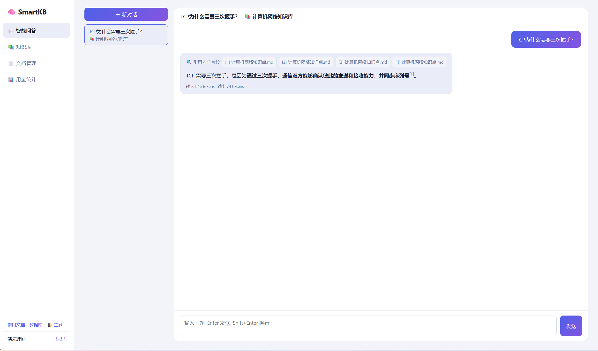
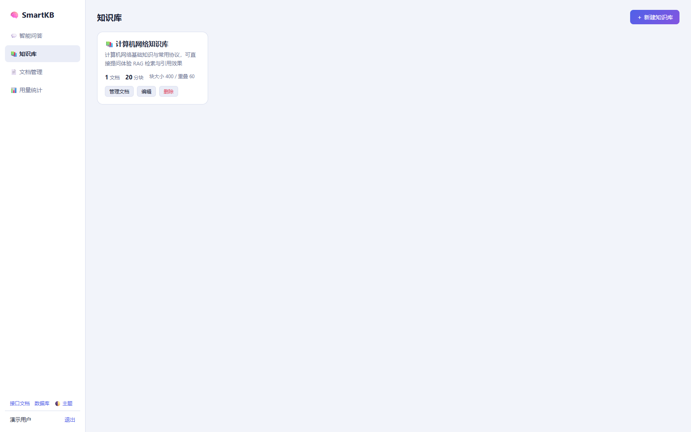
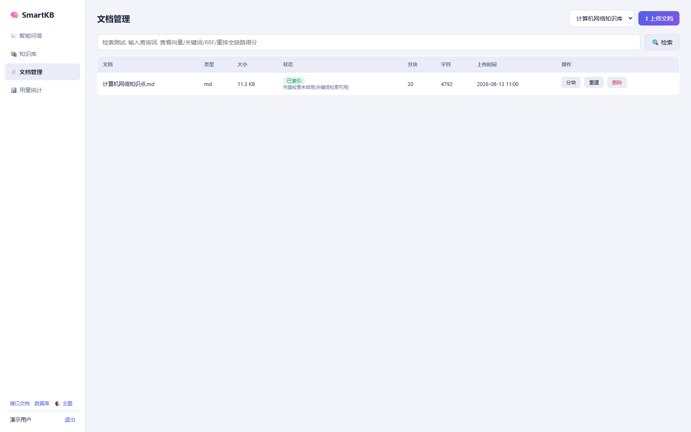
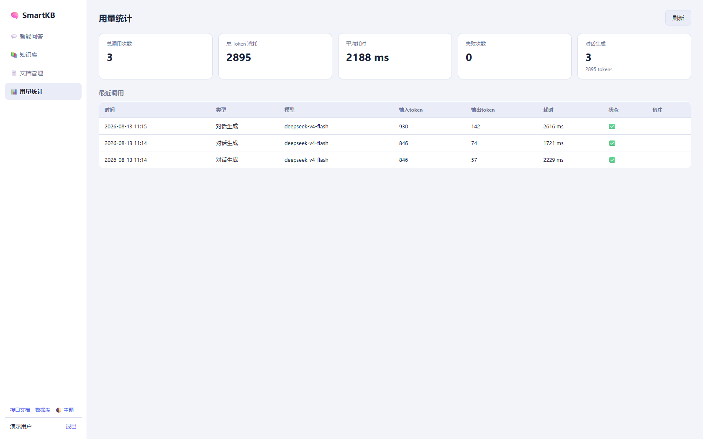
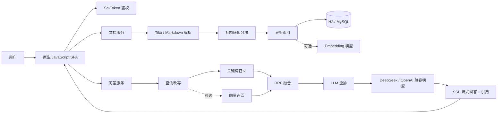

<div align="center">

# 🧠 SmartKB

### 可溯源、可降级、可观测的 AI 知识库问答系统

[](https://openjdk.org/)
[](https://spring.io/projects/spring-boot)
[](https://spring.io/projects/spring-ai)
[](#质量保障)
[](LICENSE)

上传文档 · 智能分块 · 混合检索 · RRF 融合 · 流式生成 · 引用溯源

</div>



## 项目简介

SmartKB 是一个完整的 RAG（Retrieval-Augmented Generation）知识库应用。系统能够解析多种格式的资料，将内容按标题结构切分并建立索引；用户提问后，系统先检索知识片段，再由大模型基于片段生成回答，并提供可点击的引用来源。

项目默认接入 DeepSeek OpenAI 兼容接口。DeepSeek 模式使用关键词检索完成问答；连接支持 Embedding 的模型服务后，可启用向量召回与关键词召回的混合检索链路。

> 演示账号：`demo / 123456`　·　默认端口：`8081`

## 核心能力

| 能力 | 实现 |
|---|---|
| 完整 RAG 编排 | 查询改写 → 双路召回 → RRF 融合 → LLM 重排 → 引用生成 |
| 标题感知分块 | 保留 Markdown 标题路径，优先在段落和句子边界切分，支持滑动重叠 |
| 可插拔检索 | `VectorEngine` 接口隔离存储实现，内置余弦 Top-K 引擎，可迁移 pgvector/Milvus |
| 异步文档索引 | 上传立即返回，独立线程池执行解析、分块、向量化与状态更新 |
| 流式问答 | SSE 事件协议：`sources → delta* → done / error` |
| 引用溯源 | 回答使用 `[n]` 标注来源，可查看原文、章节和检索得分 |
| 弹性降级 | 无向量模型时使用关键词检索；改写、重排失败时自动回退 |
| 权限与隔离 | Sa-Token 登录鉴权，知识库、文档和会话均执行归属校验 |
| 用量观测 | 记录模型、Token、耗时、状态和调用类型 |

## 功能展示

| 知识库管理 | 文档管理 |
|---|---|
|  |  |

| 模型用量统计 |
|---|
|  |

## 系统架构



索引和问答使用独立线程池，避免大文件处理阻塞实时对话。更完整的技术决策见 [RAG 架构与原理详解](docs/RAG架构与原理详解.md)。

## 技术栈

- 后端：Spring Boot 3.4.5、Spring AI 1.0.0、MyBatis-Plus
- 鉴权：Sa-Token
- 模型：DeepSeek 或其他 OpenAI 兼容服务
- 存储：H2（默认）、MySQL（生产配置）
- 文档解析：Apache Tika、Markdown/TXT 原文解析
- API 文档：springdoc OpenAPI / Swagger UI
- 前端：原生 JavaScript SPA，无构建工具、无 CDN 依赖
- 测试：JUnit 5

## 快速开始

### 环境要求

- JDK 17+
- Maven 3.9+

### 启动项目

```bash
git clone https://github.com/echenglight/smart-kb.git
cd smart-kb
mvn spring-boot:run
```

Windows 用户也可以直接运行 `run.bat`。

启动后访问：

| 地址 | 用途 |
|---|---|
| `http://localhost:8081` | SmartKB 管理台 |
| `http://localhost:8081/swagger-ui.html` | OpenAPI 接口文档 |
| `http://localhost:8081/h2-console` | H2 数据库控制台 |

不配置模型 Key 时，系统仍可上传、解析、分块并检索文档，但不会生成 AI 回答。

## 配置 DeepSeek

请通过环境变量提供密钥，不要把真实 Key 写入配置文件或提交到 GitHub。

### PowerShell

```powershell
$env:AI_API_KEY="你的 DeepSeek API Key"
$env:AI_BASE_URL="https://api.deepseek.com"
$env:AI_CHAT_MODEL="deepseek-v4-flash"
mvn spring-boot:run
```

### CMD

```bat
set AI_API_KEY=你的 DeepSeek API Key
set AI_BASE_URL=https://api.deepseek.com
set AI_CHAT_MODEL=deepseek-v4-flash
mvn spring-boot:run
```

| 环境变量 | 默认值 | 说明 |
|---|---|---|
| `AI_API_KEY` | 占位值 | OpenAI 兼容服务密钥 |
| `AI_BASE_URL` | `https://api.deepseek.com` | 模型服务地址 |
| `AI_CHAT_MODEL` | `deepseek-v4-flash` | 对话模型 |
| `AI_EMBEDDING_ENABLED` | `false` | 是否启用向量化 |

DeepSeek 模式默认使用关键词检索。如果切换到同时支持聊天和 Embedding 的 OpenAI 兼容服务，可将 `AI_EMBEDDING_ENABLED` 设为 `true`，并在 `application.yml` 中选择对应的向量模型。

## 典型体验流程

1. 使用 `demo / 123456` 登录。
2. 在“知识库”查看内置的计算机网络知识库。
3. 在“文档管理”查看分块结果，或上传 PDF、Word、Markdown、TXT 等资料。
4. 新建对话并提问，例如“TCP 为什么需要三次握手？”。
5. 查看回答中的引用编号及原文片段。
6. 在“用量统计”查看 Token 消耗、耗时和调用状态。

## 项目结构

```text
smart-kb/
├─ docs/                         # 架构文档与产品截图
├─ src/main/java/com/smartkb/
│  ├─ ai/                        # Embedding 调用与降级
│  ├─ auth/                      # 注册、登录和用户认证
│  ├─ chat/                      # 会话、消息和 SSE 问答
│  ├─ config/                    # 线程池、Swagger、种子数据
│  ├─ doc/                       # 上传、解析、分块和异步索引
│  ├─ kb/                        # 知识库管理
│  ├─ rag/                       # 改写、召回、融合、重排
│  ├─ stats/                     # AI 调用统计
│  └─ vector/                    # 可插拔向量检索接口
├─ src/main/resources/
│  ├─ seed/计算机网络知识点.md
│  ├─ static/                    # 前端 SPA
│  └─ application.yml
└─ src/test/                     # 分块、检索、融合和安全测试
```

## 质量保障

```bash
mvn test
```

当前包含 19 项自动化测试，覆盖：

- 文档解析与安全文件名
- 标题感知分块与滑动重叠
- 中文关键词检索
- RRF 排名融合
- 余弦相似度计算

GitHub Actions 会在推送和 Pull Request 时自动运行测试。

## 后续规划

- 接入 pgvector，实现持久化 ANN 向量检索
- 引入专用 reranker，并建立 Recall@K、MRR、NDCG 评测集
- 增加 Redis 会话缓存与语义缓存
- 支持多租户配额、审计日志和细粒度权限
- 接入 MCP 外部知识源

## 安全说明

- 仓库不会包含 API Key、数据库文件、运行日志或构建产物。
- 演示账号仅用于本地体验，部署前请删除或修改默认密码。
- 当前演示使用 SHA-256 加盐存储密码；生产环境建议使用 BCrypt/Argon2。
- 生产环境请启用 HTTPS，并使用独立的密钥管理服务。

## License

[MIT License](LICENSE)
